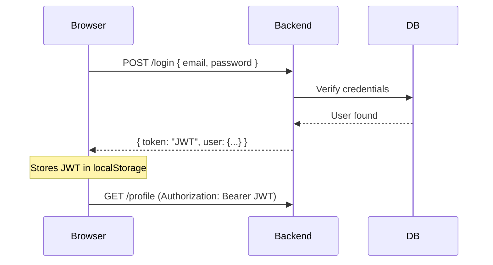
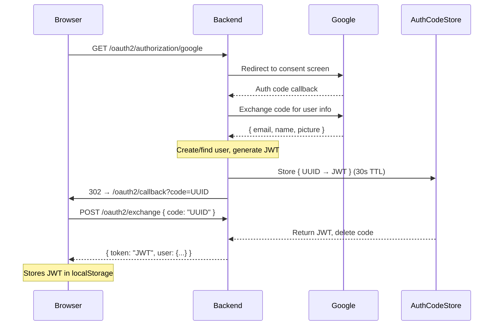
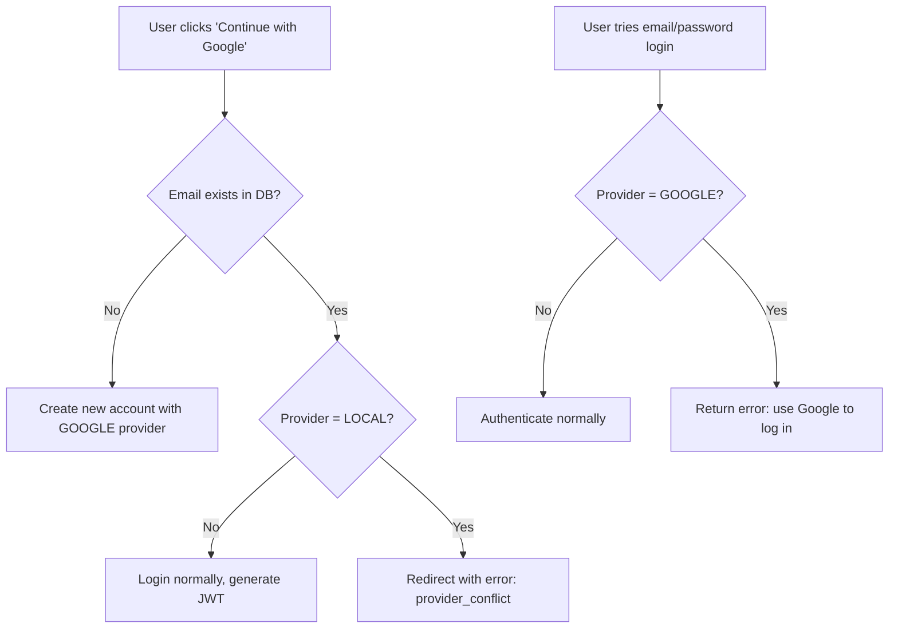

# Finance Manager

Full-stack personal finance tracker with Google OAuth2 authentication.

**Tech Stack:** Spring Boot · React (Vite) · PostgreSQL · JWT · Tailwind CSS

---

## Project Structure

```
financemanager/
├── src/main/java/com/project/financemanager/
│   ├── config/          # SecurityConfig, CORS
│   ├── controller/      # REST endpoints
│   ├── dto/             # Data transfer objects
│   ├── entity/          # JPA entities
│   ├── repository/      # Spring Data JPA
│   ├── security/        # JWT filter, OAuth2 handler, AuthCodeStore
│   ├── service/         # Business logic
│   └── util/            # JwtUtil
├── frontend/src/
│   ├── pages/           # Login, Signup, Dashboard, OAuth2Callback...
│   ├── components/      # Reusable UI components
│   ├── context/         # React context (AppContext)
│   ├── hooks/           # Custom hooks (useUser)
│   ├── util/            # Axios config, API endpoints
│   └── types/           # TypeScript interfaces
```

---

## Authentication

### Email/Password Login



### Google OAuth2 Login (with Secure Code Exchange)

The JWT is **never exposed in the URL**. Instead, a one-time code is exchanged via POST.



### Why Code Exchange?

Passing the JWT directly in the URL (`?token=eyJ...`) leaks it via:
- Browser history
- Server/CDN logs
- Referer headers

The one-time code is **random, expires in 30 seconds, and is single-use**.

### Provider Conflict Handling



---

## Key Backend Files

| File | Purpose |
|------|---------|
| `SecurityConfig.java` | Configures security filter chain, CORS, OAuth2 login, JWT filter |
| `OAuth2LoginSuccessHandler.java` | Handles Google callback → creates user → generates code |
| `AuthCodeStore.java` | In-memory `ConcurrentHashMap` store for one-time codes with 30s auto-expiry |
| `OAuth2Controller.java` | `POST /oauth2/exchange` — trades code for JWT |
| `JwtRequestFilter.java` | Intercepts requests, validates JWT, sets security context |
| `ProfileService.java` | User CRUD, login authentication, provider conflict checks |

## Key Frontend Files

| File | Purpose |
|------|---------|
| `Login.tsx` | Email/password form + "Continue with Google" button |
| `Signup.tsx` | Registration form + "Continue with Google" button |
| `OAuth2Callback.tsx` | Receives `?code=`, exchanges it for JWT via POST |
| `apiEndpoints.ts` | Centralized API URL constants |
| `axiosConfig.ts` | Axios instance with JWT interceptor |

---

## API Endpoints

| Method | Endpoint | Auth | Description |
|--------|----------|------|-------------|
| `POST` | `/register` | ❌ | Create account |
| `GET` | `/activate?token=` | ❌ | Activate via email link |
| `POST` | `/login` | ❌ | Email/password login |
| `GET` | `/oauth2/authorization/google` | ❌ | Start Google OAuth2 flow |
| `POST` | `/oauth2/exchange` | ❌ | Exchange one-time code for JWT |
| `GET` | `/profile` | ✅ | Get current user info |
| `GET/POST` | `/incomes` | ✅ | Income CRUD |
| `GET/POST` | `/expenses` | ✅ | Expense CRUD |
| `GET/POST` | `/categories` | ✅ | Category CRUD |
| `GET` | `/dashboard` | ✅ | Dashboard summary |
| `POST` | `/filter` | ✅ | Filter transactions |

---

## Running Locally

```bash
# Backend (requires Java 17+, Maven)
./mvnw spring-boot:run

# Frontend (requires Node 18+)
cd frontend
npm install
npm run dev
```

**Environment variables** (`.env`):

```
JWT_SECRET=your-secret
FINANCEMANAGER_FRONTEND_URI=http://localhost:5173
FINANCEMANAGER_BACKEND_URI=http://localhost:8080
GOOGLE_CLIENT_ID=your-google-client-id
GOOGLE_CLIENT_SECRET=your-google-client-secret
```
