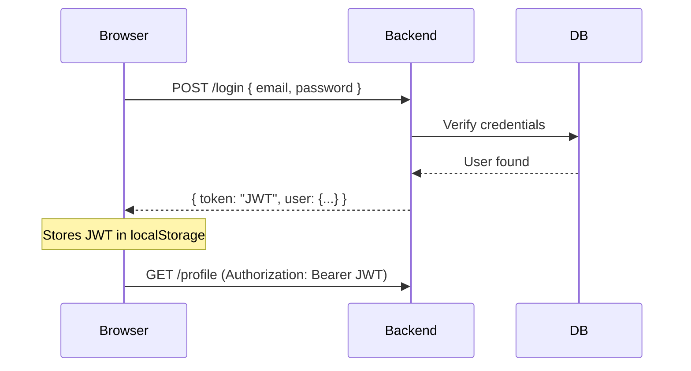
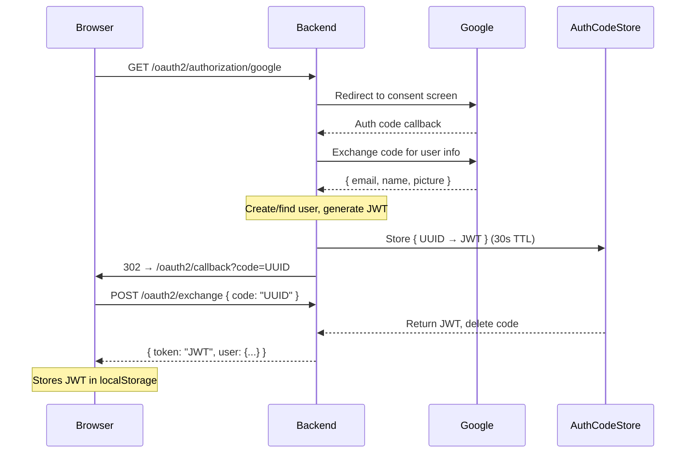
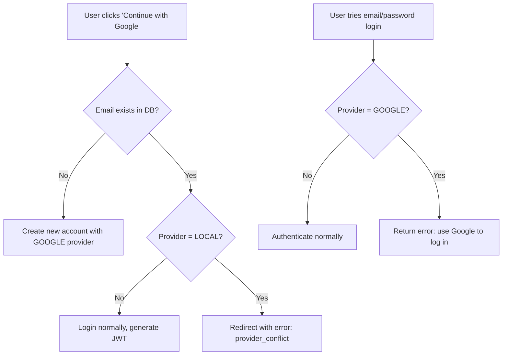
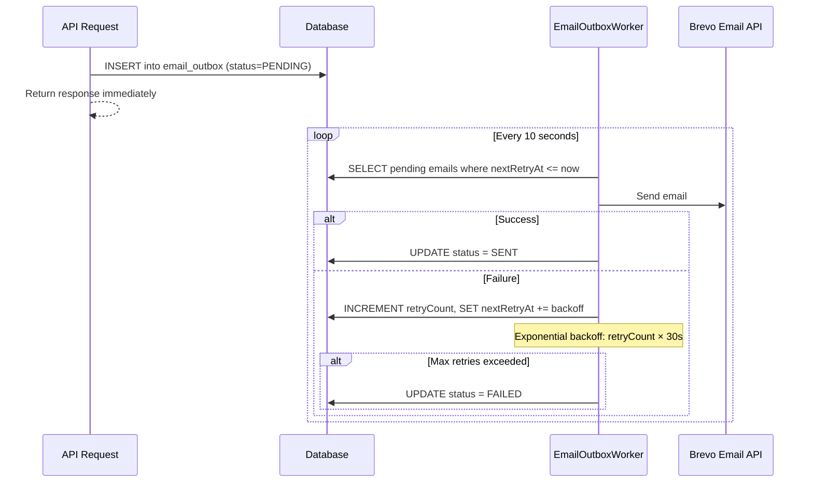

# Finance Manager

Full-stack personal finance tracker with secure Google OAuth2 authentication, automated email notifications, and Excel report generation.

**Tech Stack:** Spring Boot 4 · React 18 (Vite + TypeScript) · PostgreSQL · Spring Security · OAuth2 · JWT · Tailwind CSS · Shadcn/UI · Recharts · Apache POI · Brevo API · Cloudinary

**Live:** [Frontend (Netlify)](https://personal-finance-manager-123.netlify.app) · [Backend (Render)](https://financemanager-0296.onrender.com)

---

## Features

- **Dual Authentication** — Email/password + Google OAuth2 with provider conflict detection
- **Secure Token Delivery** — One-time authorization code exchange pattern (JWT never exposed in URL)
- **Transactional Outbox Pattern** — Reliable email delivery with automatic retries and exponential backoff
- **Scheduled Notifications** — Daily expense reminders (10 PM) and expense summary emails (11 PM) via cron jobs
- **Excel Reports** — Download/email monthly income & expense reports as `.xlsx` files
- **Dashboard** — Real-time financial overview with interactive Recharts visualizations
- **CRUD** — Full income, expense, and category management with filtering and sorting
- **Image Uploads** — Profile photos via Cloudinary integration

---

## Project Structure

```
financemanager/
├── src/main/java/com/project/financemanager/
│   ├── config/          # SecurityConfig, CORS
│   ├── controller/      # REST endpoints (Profile, OAuth2, Income, Expense, etc.)
│   ├── dto/             # Data transfer objects
│   ├── entity/          # JPA entities (Profile, Income, Expense, Category, EmailOutbox)
│   ├── repository/      # Spring Data JPA repositories
│   ├── security/        # JWT filter, OAuth2 handler, AuthCodeStore
│   ├── service/         # Business logic, EmailOutboxWorker, NotificationService
│   └── util/            # JwtUtil
├── frontend/src/
│   ├── pages/           # Login, Signup, Dashboard, OAuth2Callback, Income, Expense...
│   ├── components/      # Reusable UI (Dashboard layout, Charts, Modals, Cards)
│   ├── context/         # React context (AppContext)
│   ├── hooks/           # Custom hooks (useUser)
│   ├── util/            # Axios config, API endpoints, validation
│   └── types/           # TypeScript interfaces
```

---

## Authentication

### Email/Password Login



### Google OAuth2 Login (Secure Code Exchange)

The JWT is **never exposed in the URL**. A one-time code is exchanged via POST.



### Why Code Exchange?

Passing the JWT directly in the URL (`?token=eyJ...`) leaks it via browser history, server logs, and Referer headers. The one-time code is **random, expires in 30 seconds, and is single-use**.

### Provider Conflict Handling



---

## Email Outbox Pattern

Emails are not sent directly during API calls. Instead, they're written to an `email_outbox` table and processed asynchronously by a scheduled worker.



**Why?** — Decouples email delivery from API response time. If the email service is down, the API still responds instantly and emails are retried automatically.

---

## Key Backend Files

| File | Purpose |
|------|---------|
| `SecurityConfig.java` | Security filter chain, CORS, OAuth2 login, JWT filter |
| `OAuth2LoginSuccessHandler.java` | Handles Google callback → creates user → generates code |
| `AuthCodeStore.java` | In-memory `ConcurrentHashMap` with 30s auto-expiry for one-time codes |
| `OAuth2Controller.java` | `POST /oauth2/exchange` — trades code for JWT |
| `JwtRequestFilter.java` | Intercepts requests, validates JWT, sets security context |
| `ProfileService.java` | User CRUD, login authentication, provider conflict checks |
| `EmailOutboxWorker.java` | Scheduled worker that processes pending emails with retry logic |
| `NotificationService.java` | Daily cron jobs for expense reminders and summaries |
| `ExcelService.java` | Generates `.xlsx` reports using Apache POI |

## Key Frontend Files

| File | Purpose |
|------|---------|
| `Login.tsx` | Email/password form + "Continue with Google" button |
| `Signup.tsx` | Registration form + "Continue with Google" button |
| `OAuth2Callback.tsx` | Receives `?code=`, exchanges it for JWT via POST |
| `apiEndpoints.ts` | Centralized API URL constants |
| `axiosConfig.ts` | Axios instance with JWT interceptor |

---

## API Endpoints

| Method | Endpoint | Auth | Description |
|--------|----------|------|-------------|
| `POST` | `/register` | ❌ | Create account |
| `GET` | `/activate?token=` | ❌ | Activate via email link |
| `POST` | `/login` | ❌ | Email/password login |
| `GET` | `/oauth2/authorization/google` | ❌ | Start Google OAuth2 flow |
| `POST` | `/oauth2/exchange` | ❌ | Exchange one-time code for JWT |
| `GET` | `/profile` | ✅ | Get current user info |
| `GET/POST` | `/incomes` | ✅ | Income CRUD |
| `GET/POST` | `/expenses` | ✅ | Expense CRUD |
| `GET/POST` | `/categories` | ✅ | Category CRUD |
| `GET` | `/dashboard` | ✅ | Dashboard summary |
| `POST` | `/filter` | ✅ | Filter transactions |
| `GET` | `/excel/download/income` | ✅ | Download income Excel report |
| `GET` | `/excel/download/expense` | ✅ | Download expense Excel report |
| `POST` | `/email/income-excel` | ✅ | Email income report |
| `POST` | `/email/expense-excel` | ✅ | Email expense report |

---

## Running Locally

```bash
# Backend (requires Java 21, Maven)
./mvnw spring-boot:run

# Frontend (requires Node 18+)
cd frontend
npm install
npm run dev
```

**Environment variables** (`.env`):

```
JWT_SECRET=your-secret
FINANCEMANAGER_FRONTEND_URI=http://localhost:5173
FINANCEMANAGER_BACKEND_URI=http://localhost:8080
GOOGLE_CLIENT_ID=your-google-client-id
GOOGLE_CLIENT_SECRET=your-google-client-secret
BREVO_API_KEY=your-brevo-api-key
BREVO_EMAIL_JAVA_APP=your-sender-email
```
